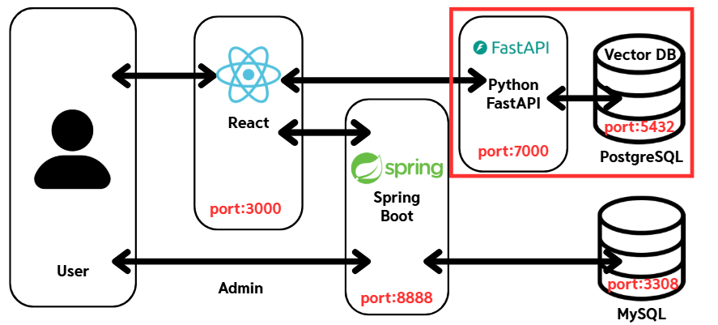
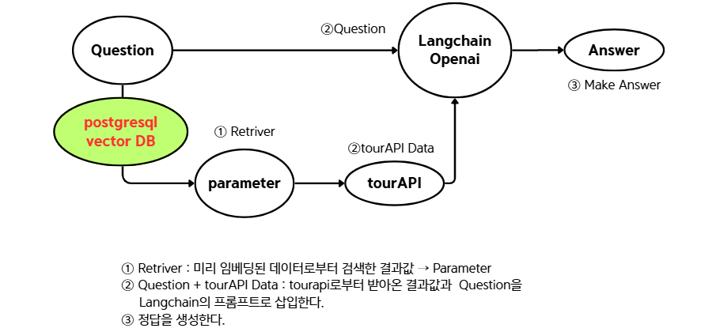
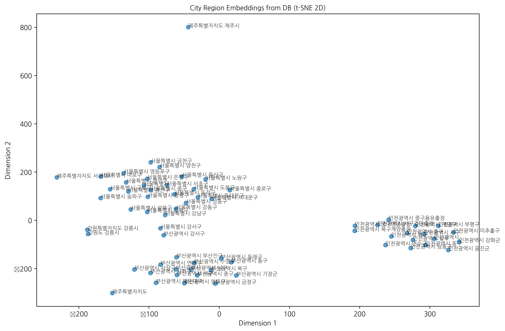

# AI Report
- 작성자 : 오상민
- 목적 : 2팀 조별과제 '온쉼 여행 프로젝트 중 사용된 AI 로직에 대한 구체적인 설명 및 정리하기 위함.
- 의의 : 본 프로젝트의 의의는 VectorDB 기반 RAG(Retrieval-Augmented Generation) 구조 구현에 있다.
    + 단순히 LLM을 이용하는 것이 아닌 임베딩을 통해 데이터베이스에 vector 형태로 변환 및 저장.
    + User의 질의에 대해 유사도 분석(Similarity Search)을 통해 검색(Retriever)을 진행.
    + 검색한 값에 따라, Param 생성하고, 이를 API 요청을 통해 외부 데이터를 갖고와 이를 프롬프트에 적용.

---
## 0. 개발 환경 구축 
1. 개발환경 및 패키지 사용
    - WSL2.0 환경에서 poetry-v0.1.0 을 사용해 가상환경을 구축.
    - 사용 패키지는 아래와 같다.
    ```
    python = "^3.12"
    fastapi = "^0.116.1"
    uvicorn = {extras = ["standard"], version = "^0.35.0"}
    sqlalchemy = "^2.0.42"
    python-dotenv = "^1.1.1"
    sqlmodel = "^0.0.24"
    pydantic = "^2.11.7"
    pyyaml = "^6.0.2"
    langchain = "^0.3.27"
    langchain-core = "^0.3.72"
    langchain-openai = "^0.3.28"
    notebook = "^7.4.5"
    ipykernel = "^6.30.1"
    pandas = "^2.3.1"
    pgvector = "^0.4.1"
    numpy = "^2.3.2"
    faiss-cpu = "^1.11.0.post1"
    psycopg2-binary = "^2.9.10"
    matplotlib = "^3.10.5"
    scikit-learn = "^1.7.1"
    ```
1. vector DB 환경 구축
    pgvector 가 설치되어있는 postgres를 사용해 설치한다.  
    수동적으로 설치하는 방법도 있으나 매우 번거롭다.
    ```
    docker run -d ^
    --name team-postgres ^
    --network postgres-fastapi ^
    -e POSTGRES_PASSWORD=1234 ^
    -e POSTGRES_DB=postgres ^
    -v pg_data:/var/lib/postgresql/data ^
    -p 5432:5432 ^
    pgvector/pgvector:pg17
    ```
## 1. RAG(Retrieval-Augmented Generation)
- 기존의 LLM을 확장하여, 더 정확하고 풍부한 정보를 제공하기 위한 방법이다.
- 학습되지 않은 데이터를 실시간으로 검색(retrieval)하고, 이를 바탕으로 생성(generation)하는 과정을 포함한다.
- 할루시네이션을 방지, 최신 정보를 반영, 더 넓은 지식 활용.
1. RAG 모델 기본 구조
- 검색 단계(Retrieval Phase) : 입력받은 질문을 바탕으로 외부 데이터를 검색한다.
- 생성 단계(Generation Phase) : 검색된 데이터를 기반으로 LLM이 답변을 생성한다.


## 2. AI 로직 및 알고리즘 설명

1. 사전 데이터 학습: '법정동 코드'와 'tourapi serveice key'에 해당되는 문자열을
2. 질문 전처리 : 질문이 주어지면서 textsplit 를 통해 분해되며 '시/도/군/구'로 끝나는 단어는 우선적으로 추출해낸다.   
3. Param 생성 : 사전에 학습된 데이터와 유사도 분석을 통해 Param을 추출하고, tourapi 에 get 요청을 통해 데이터를 받아온다.
4. 답변 생성 : 받아온 데이터와 질문을 input 하여, langchain을 통해 json 형태의 답변을 생성한다.

## 3. 사전 데이터 준비 : Dattaset
- 법정동 코드
    
    ```python
    embeddings = []
    for text in final_df["시도_시군구"]:
        response = client.embeddings.create(
            model="text-embedding-3-small",
            input=text
        )
        embeddings.append(response.data[0].embedding)

    dimension = len(embeddings[0])

    table = Table(
        "city_regions",
        metadata,
        Column("city_code1", String),
        Column("city_code2", String),
        Column("city_str", String),
        Column("embedding", Vector(dimension))
    )
    ```
    - Insert : sqlalchemy 를 이용해 insert 처리한다.
    ```python
    from sqlalchemy import insert
    with engine.connect() as conn:
        for (idx, row), embedding in zip(final_df.iterrows(), embeddings):
            stmt = insert(table).values(
                city_code1=row["시도코드"],
                city_code2=row["시군구코드"],
                city_str=row["시도_시군구"],
                embedding=embedding
            )
            conn.execute(stmt)
        conn.commit()
    ```
- Service 분류 : 아래 링크를 참조한다.   
    https://api.visitkorea.or.kr/#/useInforService
    
## 4. 유사도 분석 & tourAPI Get 요청
- 유사도 분석
    모든 words 에 대해 distance 측정 후, 가장 거리가 짧은 것으로 산출한다.
    ```python
    all_rows = []
        for word in words:
            embedding = self.__get_embedding(word)
            rows = db_func(embedding, top_k=top_k)
            all_rows.extend(rows)
        return sorted(all_rows, key=lambda x: x["distance"])[:1]
    ```

- tourAPI Get 요청
    ```python
    self.__url = "https://apis.data.go.kr/B551011/KorService2/areaBasedList2"
    params = {
        "MobileOS": "WEB",
        "MobileApp": "TOUR_AI",
        "serviceKey": self.__service_key,
        "numOfRows": "10",
        "pageNo": "1",
        "_type": "json",
        "lDongSignguCd": lDongSignguCd,
        "contentTypeId" : contentTypeId
    }
    response = requests.get(self.__url, params=params)
    ```

## 5. Prompt
- 결과값을 의도하기 위해 프롬프트 또한 작성해주었다. 크게 5가지에 주의하여 작성했다.
    1. 포멧 정의
    1. 역할 정의 
    1. 제한 조건 부여
    1. 답변 구조 & 텍스트 포멧 정의
    1. 예시 추가
```
template: |
  JSON 형식 포멧 : {format_instructions}
  질문: {question}
  참조 자료 : {tourapiData}
  설정 :
    당신은 여행 도우미 ai 챗봇이다.
  
    1. 반드시 참조자료(tourapiData)를 기반으로 답변하세요.
    2. 출력은 오직 하나의 JSON 객체만 반환합니다(코드블록, 마크다운 금지).
    3. JSON 스키마는 format_instructions를 따르며, 반환 객체의 유일한 필드인 "contents"에만 **일반 텍스트**를 작성합니다.
    4. "contents" 안의 텍스트는 HTML 태그나 마크다운 없이 **순수 텍스트**만 사용합니다.
    5. 참조자료를 단순 나열하지 말고, 각 장소의 특징·분위기·추천 이유를 자연스럽게 설명하세요.
    6. 가능하면 테마(도서관, 공연장, 문화센터 등)별로 묶어 섹션을 구성하세요.
    7. 답변 구조(권장):
       - 서두: 지역 전반 분위기 요약
       - 본문: 테마별로 장소들을 자연스럽게 소개
       - 마무리: 간단한 추천 멘트
    8. 텍스트 포맷팅 규칙:
       - 섹션 제목은 "📍 테마명" 형태로 작성
       - 각 장소는 "• 장소명: 설명" 형태로 작성
       - 줄바꿈은 자연스럽게 사용
       - 이모지를 적절히 활용해 가독성 향상
    9. 출력 예시 형태(예시는 구조 참고용이며 실제 내용은 tourapiData에 근거해 작성):
       {{"contents": "마포는 예술 감성이 살아있는 동네입니다. \n고풍스러운 건축물과 현대적인 요소가 조화를 이루며, 다양한 관광지가 방문객을 맞이합니다.\n\n📍 역사적 명소\n• 경복궁: 조선 왕조의 대표적인 궁궐로, 아름다운 정원과 건축물이 인상적입니다.\n• 건청궁: 조선시대의 전통적인 궁궐로, 고요한 분위기에서 역사적 가치를 느낄 수 있습니다.\n\n📍 문화재\n• 경희궁: 조선시대의 궁궐로, 역사적인 의미가 깊고 아름다운 정원이 매력적입니다.\n\n💡 TIP: 종로구는 다양한 문화재와 역사적 장소가 많으니, 여유롭게 둘러보시길 추천합니다."}}
```

## 6. 결과값 (Langsmith)
- LangSmith : LLM 애플리케이션 개발, 모니터링 및 테스트 를 위한 플랫폼. 추적 기능을 제공.
- Inupt : tourAPI Data 값이 프롬프트와 함께 잘 입력됨을 알 수 있다.
    

- output : prompt 에서 요구한대로 잘 출력됨을 알 수 있다.
    